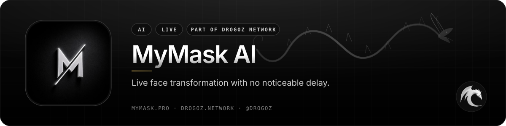
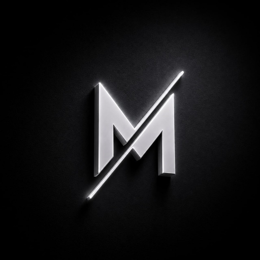
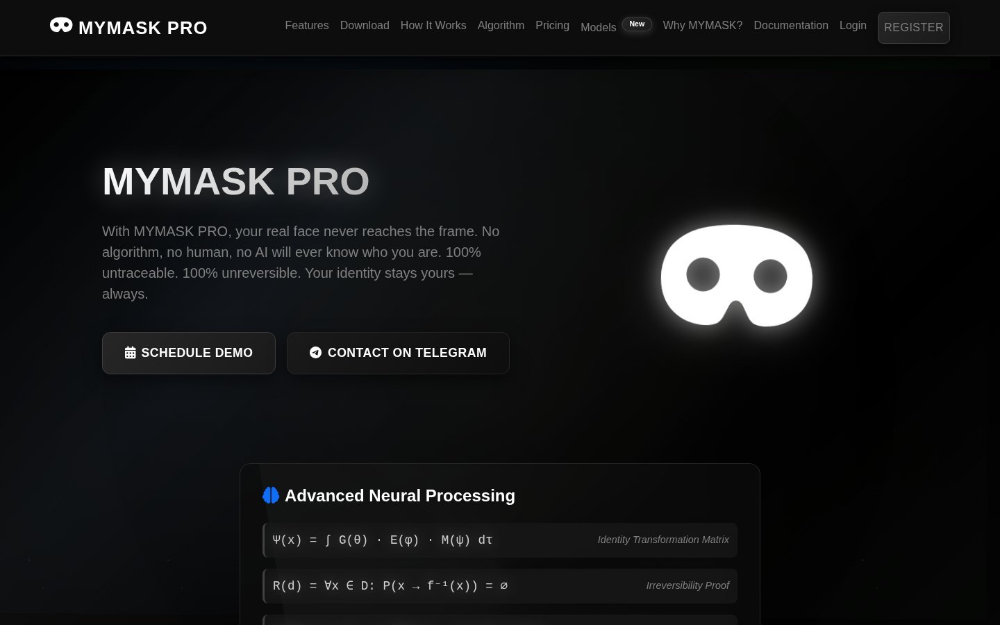
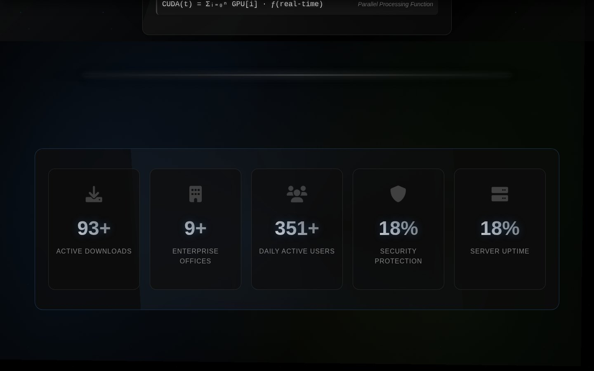
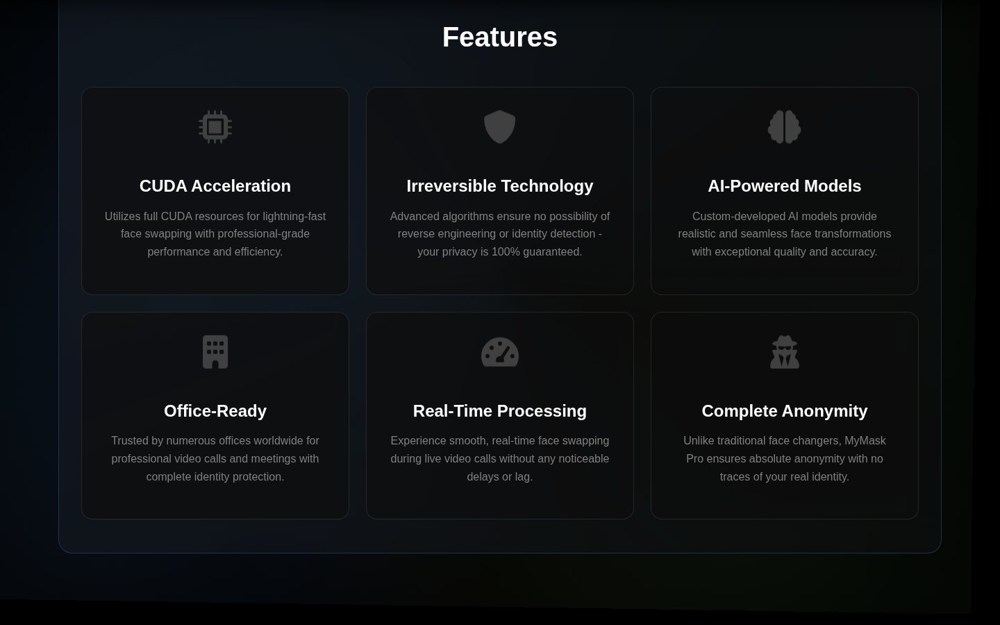

  

# MyMask AI

### Live face transformation with no noticeable delay.

 

  

 

## 📋 Table of contents

- [Overview](#-overview)
- [Key features](#-key-features)
- [Screenshots](#-screenshots)
- [How it works](#%EF%B8%8F-how-it-works)
- [Use cases](#-use-cases)
- [Pricing](#-pricing)
- [Free live demonstration](#-free-live-demonstration)
- [Links](#-links)

## 🧭 Overview

MyMask AI (MYMASK PRO) is a real-time face transformation system: your real face never reaches the frame. Built on custom AI models with full CUDA acceleration, it delivers live face swapping during video calls and recordings without noticeable delay, while maintaining natural expressions and movements.

The platform is engineered for anonymity. Proprietary algorithms combine advanced neural networks, CUDA acceleration and cryptographic transformations so that transformed faces cannot be reverse-engineered or analysed to reveal the original identity. All processing is done locally on your device, with no data transmitted to external servers.

MYMASK PRO is office-ready and trusted by numerous offices worldwide for secure video communications. It ships as a Windows 10/11 desktop application (version 3.1), and the Elite package lets you upload your own images and train a personalised AI model in seconds.

<table>
<tr>
<td align="center" width="25%"><b>Category</b> AI</td>
<td align="center" width="25%"><b>Status</b> Live</td>
<td align="center" width="25%"><b>Bundle</b> Utilities (−2%)</td>
<td align="center" width="25%"><b>Pricing</b> Sign in to see pricing</td>
</tr>
</table>

## ✨ Key features

### ⚡ Performance

- **Real-Time Face Swapping** — live face transformation with no noticeable delay.
- **CUDA Acceleration** — maximum GPU performance for fast processing.
- **Low Latency** — fast and responsive performance during live calls.
- **Built for Scale** — designed for high-volume operations.

### 🧬 AI quality

- **Advanced AI Models** — realistic and accurate face generation from custom-developed neural networks.
- **High Quality Output** — natural appearance and smooth movements.
- **Custom AI models (Elite package)** — upload your own photos; the training pipeline processes them in seconds and delivers a model ready for instant use.

### 🔒 Anonymity & security

- **Irreversible Technology** — transformations cannot be reverse-engineered; zero possibility of identity reconstruction.
- **Complete Anonymity** — no traces of your real identity, unlike traditional face changers.
- **Local processing** — everything runs on your device; no data is transmitted to external servers.
- **Anti-Detection Matrix** — adaptive algorithms that learn from detection patterns and continuously evolve.

### 🏢 Deployment

- **Office Ready** — optimized for professional use and high-stakes business environments.
- **Multi-Platform Support** — works with major communication tools.
- **Windows desktop app** — MYMASK PRO Desktop v3.1 for Windows 10/11 with quick setup and auto updates.
- **System requirements** — Windows 10/11 (64-bit), NVIDIA GPU (CUDA 11.0+), 8 GB RAM (16 GB recommended), 500 GB free disk space, DirectX 12, internet connection.

## 🔬 The science behind MYMASK PRO

| Layer | What it does |
|---|---|
| **Neural Network Transformation** | Advanced Generative Adversarial Network with custom loss functions ensuring pixel-perfect transformation while maintaining facial expressions. |
| **Cryptographic Irreversibility** | Irreversible hash transformations combined with one-way encryption ensuring zero possibility of identity reconstruction. |
| **CUDA Optimization** | Parallel GPU processing with optimized memory allocation achieving real-time transformation at 4K resolution. |
| **Anti-Detection Matrix** | Adaptive algorithms that learn from detection patterns and continuously evolve to stay undetectable. |

## 📰 Latest update — *MYMASK AI — Major Update* (13 Aug 2026)

> After a long wait, we've officially unlocked a major set of new capabilities — see the full changelog in the client panel at drogoz.network.

## 🖼️ Screenshots

> Product images from [mymask.pro](https://mymask.pro/) and the [service page](https://drogoz.network/services/MyMask/) on drogoz.network.

<table>
<tr>
<td width="50%" align="center"> MYMASK PRO — landing page</td>
<td width="50%" align="center"> MYMASK PRO — live metrics</td>
</tr>
<tr>
<td colspan="2" align="center"> MYMASK PRO — features</td>
</tr>
</table>

## ⚙️ How it works

**From install to live in three steps**

```mermaid
%%{init: {'theme': 'dark', 'themeVariables': { 'primaryColor': '#1a1a1a', 'primaryTextColor': '#ffffff', 'primaryBorderColor': '#c9a855', 'lineColor': '#c9a855', 'secondaryColor': '#0d0d0d', 'tertiaryColor': '#0d0d0d', 'clusterBkg': '#0d0d0d', 'clusterBorder': '#404040', 'edgeLabelBackground': '#0d0d0d', 'fontFamily': 'Inter, Segoe UI, sans-serif' } } }%%
flowchart LR
    A["1 · Install & Setup<br/>Download MYMASK PRO, CUDA is configured automatically"] --> B["2 · Choose Your Model<br/>Pick a crafted AI model or train your own (Elite)"]
    B --> C["3 · Go Live<br/>Real-time transformation in your video call"]
    subgraph Engine["Local processing — nothing leaves your device"]
        direction LR
        N["Neural Network<br/>Transformation (GAN)"] --> K["Cryptographic<br/>Irreversibility"] --> G["CUDA<br/>Optimization"] --> D["Anti-Detection<br/>Matrix"]
    end
    C -.-> Engine
```

## 🎯 Use cases

<table>
<tr>
<td width="50%" valign="top"><b>💼 Professionals on video calls</b> Maintain anonymity during video calls while keeping natural expressions and movement.</td>
<td width="50%" valign="top"><b>🎥 Content creators</b> Identity protection for live streams and recordings.</td>
</tr>
<tr>
<td width="50%" valign="top"><b>🏢 Organisations</b> Secure video communications and protected employee identities in corporate environments.</td>
<td width="50%" valign="top"><b>📈 High-volume offices</b> Built for scale — optimized for professional, high-volume operations.</td>
</tr>
</table>

## 💳 Pricing

> **Sign in at [drogoz.network](https://drogoz.network/accounts/login/) to see pricing.** Billed per user · Min. 1 user.

MyMask AI is part of the **Utilities** bundle (−2%) — *Core utility tools* — and of **All In One** (−10%) — *Every product, best price*. Take several products together and save more: [Packages & bundles](https://drogoz.network/#packages) · [Pricing & calculator](https://drogoz.network/pricing/).

| Bundle | Discount | Included |
|---|---|---|
| **Utilities** | −2% | Drog AI, MyMask AI, Replika, IMPERATORI, RiderSwap, Vadira, Skriper |
| **All In One** | −10% | Drog AI, MyMask AI, Replika, Lidaro AI, IMPERATORI, ZOI Talks, RiderSwap, HyperBlast AI, VerifHub AI, Vadira, Skriper |

## 🎥 Free live demonstration

**A live demonstration is 100% free on every product.** 
See MyMask AI in action before you pay — our agent gets in touch and walks you through a live demonstration.

Registration is handled by our team — get in touch and receive personal access.

## 🔗 Links

| Channel | Link |
|---|---|
| 🌐 **Website** | [mymask.pro](https://mymask.pro/) |
| 📄 **Details page** | [drogoz.network/services/MyMask/](https://drogoz.network/services/MyMask/) |
| ✈️ **Telegram group** | [@mymask_ai](https://t.me/mymask_ai) |
| 🏛️ **Drogoz Network** | [drogoz.network](https://drogoz.network) · [Services](https://drogoz.network/#services) · [Packages](https://drogoz.network/#packages) · [Pricing](https://drogoz.network/pricing/) · [Presentation](https://drogoz.network/presentation/) |
| ⚖️ **Legal** | [Terms of Service](https://drogoz.network/legal/terms-of-service/) · [Acceptable Use](https://drogoz.network/legal/acceptable-use-policy/) · [Privacy](https://drogoz.network/legal/privacy-policy/) · [Refunds](https://drogoz.network/legal/refund-policy/) · [Disclaimer](https://drogoz.network/legal/disclaimer/) · [Compliance](https://drogoz.network/legal/compliance-policy/) |
| 🐙 **GitHub** | [deepdrogo](https://github.com/deepdrogo/deepdrogo) |

 

   
  
    
  <b>Made by <a href="https://drogoz.network">Drogoz Network</a></b> 
  One network — all your services · Premium SaaS Network
    
  
  
  
  
    
  <b>More from the network:</b> <a href="https://github.com/deepdrogo/drog-ai">Drog AI</a> · <a href="https://github.com/deepdrogo/replika">Replika</a> · <a href="https://github.com/deepdrogo/lidaro-ai">Lidaro AI</a> · <a href="https://github.com/deepdrogo/imperatori">IMPERATORI</a> · <a href="https://github.com/deepdrogo/zoi-talks">ZOI Talks</a> · <a href="https://github.com/deepdrogo/riderswap-io">RiderSwap</a> · <a href="https://github.com/deepdrogo/hyperblast-ai">HyperBlast AI</a> · <a href="https://github.com/deepdrogo/verifhub-ai">VerifHub AI</a> · <a href="https://github.com/deepdrogo/vadira-net">Vadira</a> · <a href="https://github.com/deepdrogo/skriper-io">Skriper</a>
    
  © 2026 Drogoz Network. All rights reserved. Provided strictly for lawful use — see the <a href="https://drogoz.network/legal/">Legal Center</a>. Each user is solely responsible for how they use the software.

